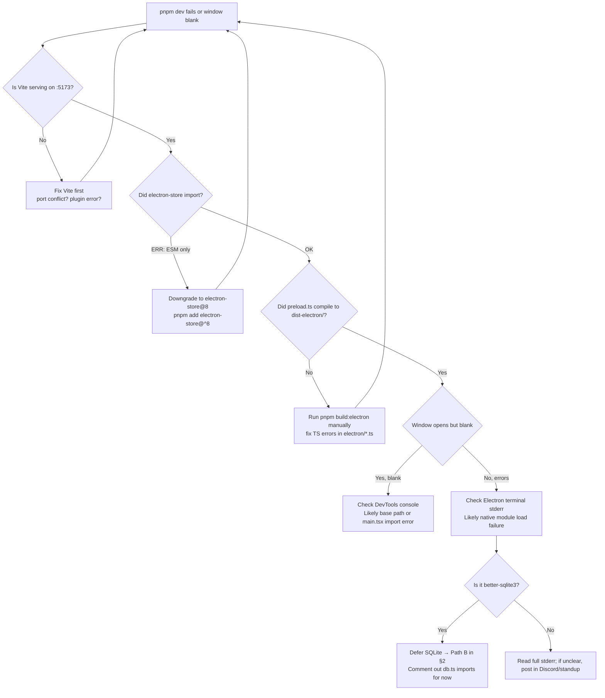
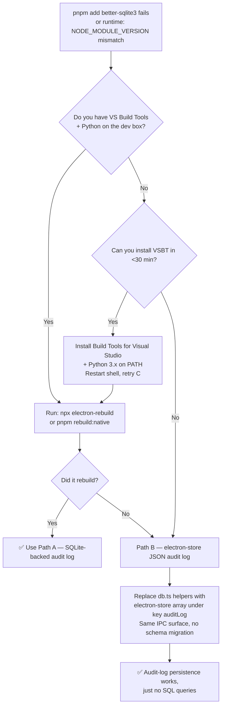
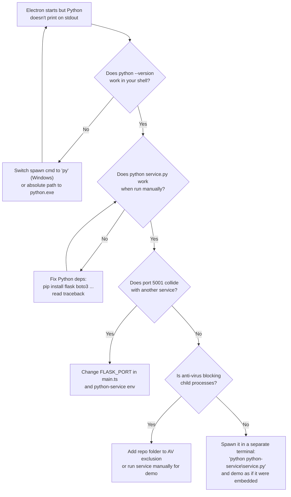
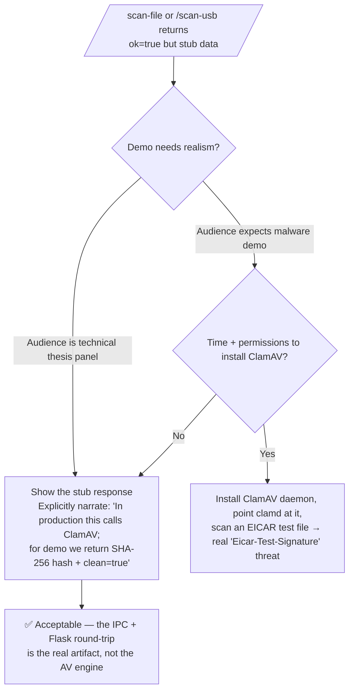
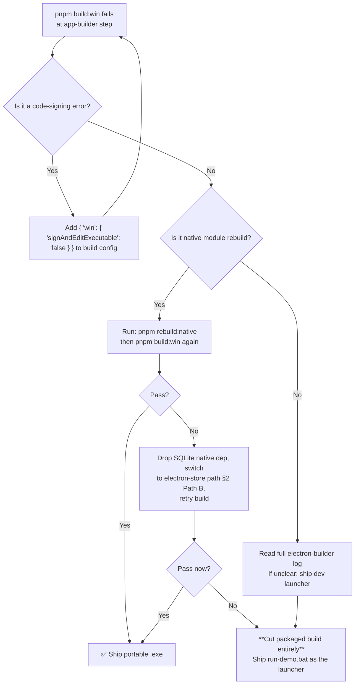
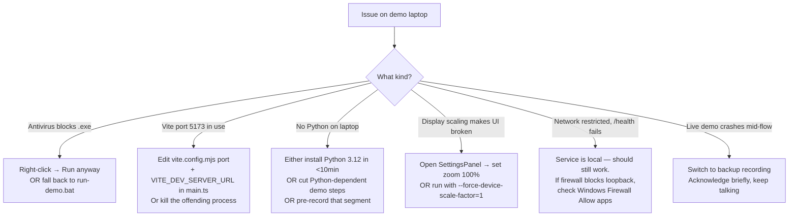
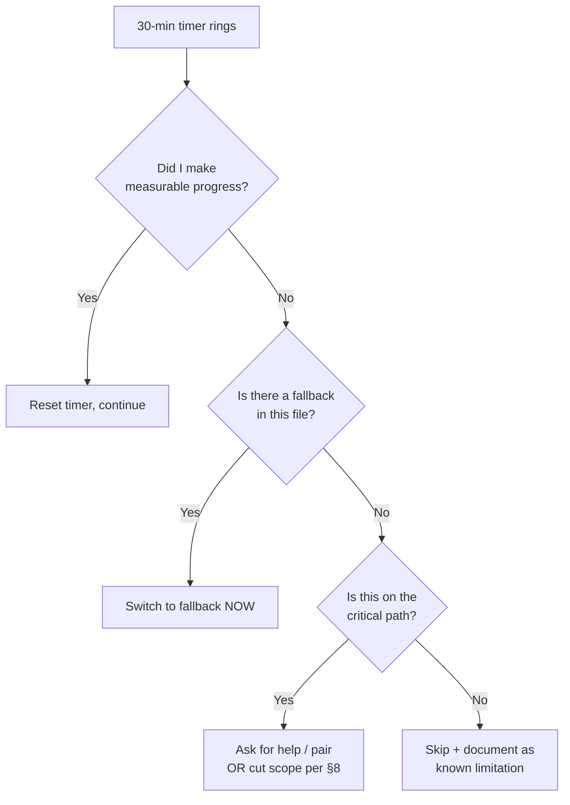

# Decision Trees — Gaps & Risk Mitigation

For every known gap or risk, this file gives you (a) a **decision tree** to determine which path to take, (b) the **fallback plan**, and (c) the **explicit cut** if everything else fails. Consult this **before** spending more than 30 minutes fighting any single problem.

---

## §1 Electron won't boot in dev (Day 1)



**Fallback if Day 1 won't pass by EOD:** Drop Electron entirely for the demo and present the React UI as a Chrome web app launched in `--app` mode (`chrome --app=http://localhost:5173`). You lose tray + kiosk + IPC, but you keep the visuals. Document this as a thesis limitation.

---

## §2 better-sqlite3 won't compile (Day 1 / Day 3)

`better-sqlite3` is a native module. It needs a C++ toolchain to build against the Electron headers.



**Decision rule:** If you're past 90 min total on `better-sqlite3`, **switch to Path B**. Don't sink Day 1 or Day 3 over a storage detail the panelists won't ask about.

---

## §3 Python service won't spawn (Day 3)



**Demo-day fallback:** Run `python python-service\service.py` in a **separate Windows Terminal** before launching the Electron app. The IPC `python:call` handler hits `localhost:5001` either way — the user can't tell the difference.

---

## §4 ClamAV / pyusb not installed (Day 3)

The Python service is **already designed to gracefully stub** when these libs are missing — see `python-service/service.py` lines 36–47.



**Pro tip:** If ClamAV IS installed, drop a `eicar.com` test file (the standard harmless AV test signature) on the desktop and scan that during the demo for a real "threat detected" toast.

---

## §5 Groq / `/ai-task` doesn't have API key (Day 4 / Day 5)

`/ai-task` is expected for the defense run. If provider auth fails on the day, keep the endpoint live and fall back to clearly-labeled local responses (do not cut the assistant flow).

```mermaid
flowchart TD
    A[POST /ai-task fails<br/>auth/network/provider error] --> B{Is GROQ_API_KEY set<br/>in python-service/.env?}
    B -- No --> C[Keep /ai-task route active but return<br/>clearly-labeled local fallback response]
    B -- Yes --> D{Is AI_PROVIDER='groq'<br/>and model valid?}
    D -- No --> D1["Set AI_PROVIDER=groq<br/>and GROQ_MODEL=llama-3.3-70b-versatile"]
    D1 --> E
    D -- Yes --> E[Test with curl directly to Flask:<br/>curl -XPOST localhost:5001/ai-task<br/>-d '{prompt:hello}']
    E --> G{200 response?}
    G -- Yes --> H[✅ Wire a small chat UI<br/>or canned button into admin console]
    G -- No --> C
```

**Canned-response fallback** (5-minute change): in `service.py` `/ai-task`, return a clearly-labeled local response:
```py
return jsonify(ok=True,
    response=("Today's lab activity summary: 24 students across COMLAB 8, 1 quarantine event "
             "in COMLAB 8 PC-01 (kill_linux_skills.exe). All security protocols nominal."),
    input_tokens=0)
```
In defense narration, explicitly state this is a fallback response because Groq credentials were unavailable on that machine.

---

## §6 Native rebuild fails for `electron-builder` (Day 5)



**The `run-demo.bat` launcher is just as legitimate as a packaged `.exe` for a thesis demo.** Don't burn Day 5 morning fighting `electron-builder`.

---

## §7 Demo machine misbehaves (Day 5 / Demo day)



**Day-of demo non-negotiables:**
1. Reboot 1 hour before. Do nothing else on the laptop.
2. Disable Windows Update + Defender real-time scan during demo.
3. Have backup video pre-loaded in second monitor / Alt-Tab spot.
4. Have charger plugged in.
5. Have a pre-warmed `pnpm dev` already running before the panel sits down.

---

## §8 Scope-cut decision matrix

If by **end of Day N** you don't have **enough**, here's what to drop, in order:

| Day | If you're behind, drop … | Reason it's safe to drop |
|---|---|---|
| 1 | Tray icon (use Electron default) | Cosmetic; demo still works |
| 1 | Single-instance lock | Nice-to-have; demo doesn't open twice |
| 2 | Tray Logout menu item | Dropdown logout still works |
| 2 | Persistent session checkbox semantics | All sessions persistent by default |
| 3 | SQLite path → fallback to electron-store JSON | Same UX, simpler infra |
| 3 | `/scan-usb` (just keep `/scan-file`) | One real action is enough |
| 3 | Health badge | Demo audience won't notice |
| 4 | Lock Cluster persistence (just toggle UI state) | Audit log is the persistence proof |
| 4 | Kiosk mode toggle | Frameless window already feels kiosk-y |
| 4 | Tray notifications | Toasts cover the same UX |
| 5 | Packaged `.exe` (use dev launcher) | Already in §6 |
| 5 | `/ai-task` Groq | Already cut by default |

**Last-resort minimum viable demo (~2.5 days of work):**
- Electron window opens with React UI.
- Hardcoded login routes admin vs student.
- One mock alert in the dashboard.
- One real button that calls Python `/scan-file` and shows a toast.
- Logout works.

That's it. Even this is enough to prove the architecture is real.

---

## §9 Time-box rules (apply to every step)

Before going into a hole on any single bug, set a 30-min timer. When it rings:



**The most expensive bug in a 5-day sprint is the one you spent two days on instead of routing around.**
