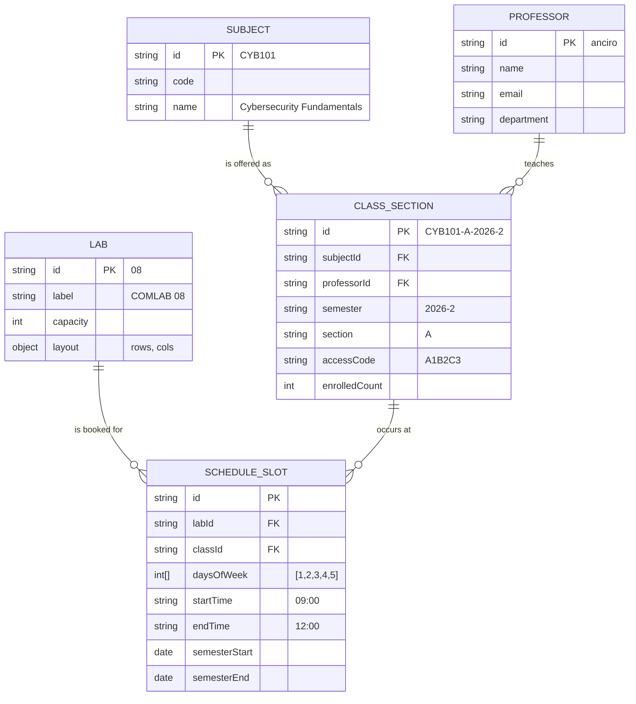

# Scheduling Architecture — Lab × Class × Time

> Anticipates the likely panelist question: *"Can the admin add the semester's class schedule?"*
> The answer should be **"Yes — the data model already separates physical labs from academic classes from time-bound schedule slots. Adding the admin CRUD UI is the next milestone."**

This document extends the comlab modularity work in `frontend-audit-decisions.md` (Tier 1, items 8-11) with the data model that supports a future schedule-management feature. The data model lands **now**, the admin CRUD UI is **deferred** (with a stubbed nav entry to signal intent).

---

## TL;DR

1. **Decompose into 5 entities** — `Lab`, `Subject`, `Professor`, `ClassSection`, `ScheduleSlot`. Each lives in its own file under `src/app/config/`.
2. **All UI reads through pure resolver functions** like `getCurrentSessionView(labId)`. No panel knows about the underlying storage.
3. **For the defense:** ship the data model + resolvers + a read-only "Schedule Overview" admin panel. Stub the "Add / Edit Schedule" CRUD as "Coming in next milestone." This is enough to prove feasibility without building forms we won't have time to test.

---

## Why decompose Lab and Schedule?

Right now the codebase conflates a *physical lab* (the room and its 30 PCs) with the *academic activity* happening inside it (Prof. Anciro's Cybersecurity class). Concretely:

```typescript
// today — collapsed
{ id: "08", subject: "CYBERSECURITY", professor: "Prof. Anciro", ... }
```

That collapses three different things:

| Thing | Lifetime | Owned by |
|---|---|---|
| The physical lab (room + PCs + capacity) | Permanent (years) | Facilities |
| The class section (subject + professor + access code) | One semester | Registrar |
| The actual time slot (Mon-Fri 09:00-12:00 in Lab 8) | One semester | Scheduler |

When the panelist asks "what if Prof. Anciro moves to COMLAB 09 next week?" the collapsed model requires editing the lab. The decomposed model just reassigns one ScheduleSlot's `labId`.

---

## Entities & relationships



Reading clockwise: a `Subject` is offered as one or more `ClassSection`s (different semesters / sections / professors). Each `ClassSection` is taught by one `Professor`. Each `ClassSection` is held in a `Lab` at specific times via one or more `ScheduleSlot`s.

---

## File layout

```
src/app/config/
├── labs.ts            ← physical labs (today's COMLAB 08)
├── subjects.ts        ← course catalog (Cybersecurity, App Dev, ...)
├── professors.ts      ← faculty list
├── classes.ts         ← per-semester class sections (incl. access codes)
├── schedule.ts        ← time-bound bookings (lab × class × time)
└── index.ts           ← re-exports + resolver functions
```

Single-source-of-truth principle: every panel imports only from `src/app/config` — never reads from the raw arrays directly. This keeps the UI swap-ready when we later move data to electron-store / SQLite / a real API.

---

## Concrete COMLAB 08 example (what ships in the demo)

```typescript
// labs.ts
export const LABS: Lab[] = [
  { id: "08", label: "COMLAB 08", capacity: 32, layout: { rows: 4, cols: 8 } },
];

// subjects.ts
export const SUBJECTS: Subject[] = [
  { id: "CYB101", code: "CYB101", name: "Cybersecurity Fundamentals" },
];

// professors.ts
export const PROFESSORS: Professor[] = [
  { id: "anciro", name: "Prof. Andy Anciro",
    email: "a.anciro@runa.edu.ph", department: "Computer Science" },
];

// classes.ts
export const CLASSES: ClassSection[] = [
  { id: "CYB101-A-2026-2", subjectId: "CYB101", professorId: "anciro",
    semester: "2026-2", section: "A", accessCode: "A1B2C3", enrolledCount: 32 },
];

// schedule.ts
export const SCHEDULE: ScheduleSlot[] = [
  { id: "slot-cyb101-a-mwf", labId: "08", classId: "CYB101-A-2026-2",
    daysOfWeek: [1, 2, 3, 4, 5], startTime: "09:00", endTime: "12:00",
    semesterStart: "2026-01-15", semesterEnd: "2026-05-30" },
];
```

**Adding a second lab + class later** is two appends — no new files, no JSX changes:

```typescript
LABS.push({ id: "09", label: "COMLAB 09", capacity: 30, layout: { rows: 5, cols: 6 } });
CLASSES.push({ id: "APP201-B-2026-2", subjectId: "APP201", professorId: "santos", ... });
SCHEDULE.push({ id: "slot-app201-b", labId: "09", classId: "APP201-B-2026-2", ... });
```

---

## Resolver API (the only thing UI panels call)

Co-located in `src/app/config/index.ts`. Pure functions, easily unit-testable, swappable for an async API later.

```typescript
// Lookup primitives
export function getLab(id: string): Lab | null;
export function getSubject(id: string): Subject | null;
export function getProfessor(id: string): Professor | null;
export function getClass(id: string): ClassSection | null;

// Listings
export function listLabs(): Lab[];
export function listClassesBySemester(semester: string): ClassSection[];
export function listScheduleByLab(labId: string): ScheduleSlot[];
export function listScheduleByProfessor(profId: string): ScheduleSlot[];

// Hydrated views (the panels call these)
export interface CurrentSessionView {
  lab: Lab;
  slot: ScheduleSlot;
  classSection: ClassSection;
  subject: Subject;
  professor: Professor;
  remainingSeconds: number;   // computed from now vs. endTime
}

export function getCurrentSessionView(labId: string, now?: Date): CurrentSessionView | null;
export function getDailySchedule(labId: string, date?: Date): CurrentSessionView[];

// Validation (used by AccessCodePage)
export function validateAccessCode(code: string, now?: Date): ClassSection | null;

// Future admin CRUD (interface defined now, implementations defer)
export interface ScheduleAdmin {
  createSlot(input: Omit<ScheduleSlot, "id">): ScheduleSlot;
  updateSlot(id: string, patch: Partial<ScheduleSlot>): ScheduleSlot;
  deleteSlot(id: string): boolean;
  // class / subject / professor CRUD also here
}
```

For the defense: the lookup + listing + hydrated-view functions are real. The `ScheduleAdmin` interface exists as a TypeScript declaration only — it shows the panelist that the admin write path is *designed*, just not implemented yet.

---

## Where existing UI changes (read sites)

| Panel | Today (hardcoded) | After (resolver call) |
|---|---|---|
| `LabDashboardPanel` | `comlabs[i].subject`, `comlabs[i].util` | `getCurrentSessionView(lab.id)?.subject.name` |
| `LabMonitoringPanel` | `professors[activeTab]` map | `getCurrentSessionView(activeTab)` returns full hydrated view |
| `AuditTrailsPanel` "Active Session" card | `sessions[activeTab].subject` | same — `getCurrentSessionView(activeTab)` |
| `AccessCodePage` | navigates regardless | `validateAccessCode(typed)` returns the class — navigate only on hit |
| `StudentDashboard` (header) | "j.doe@runa.edu.ph" hardcoded | "Cybersecurity · Anciro · 09:00-12:00" pulled from `getCurrentSessionView` of the student's enrolled class |

Every existing panel keeps its layout. Only the *source* of strings changes.

---

## What to build NOW vs. defer

### Build now (Tier 1.5, folded in with the comlab modularity refactor)

| Item | Files | Effort | Why now |
|---|---|---|---|
| The 5 config files + types | `src/app/config/{labs,subjects,professors,classes,schedule}.ts` | 30 min | Foundation; cheap |
| The resolver `index.ts` | `src/app/config/index.ts` | 30 min | UI calls these |
| Refactor 4 panels to read through resolvers | (existing files) | included in comlab refactor | Eliminates string duplication |
| **Wire `validateAccessCode` into `AccessCodePage`** | `AccessCodePage.tsx` | 15 min | Closes a real-action loop ("admin schedules class with access code A1B2C3 → student types it in → access granted"). Strong demo moment. |
| Stub "SCHEDULE" nav item in admin sidebar | `Dashboard.tsx`, new `SchedulePanel.tsx` | 20 min | Read-only weekly view. Signals admin schedule UI is the next milestone. |

**Total ~2 hrs on top of the existing Tier 1 plan.** Brings Tier 1.5 to ~5.5 hrs.

### Build for Day 4 (stretch — only if Tier 1 + Day 2 + Day 3 all land cleanly)

| Item | Effort |
|---|---|
| Read-only **Weekly Grid** view inside `SchedulePanel` (renders `SCHEDULE` as a Mon-Fri × time-of-day grid) | 1.5 hrs |
| "Today's Sessions" sidebar card on the admin dashboard | 30 min |

### Defer to post-defense (mention as roadmap)

| Item | Why defer |
|---|---|
| Admin CRUD forms (Add/Edit/Delete schedule slot) | High UX surface; needs validation, conflict detection, time pickers. Not a feasibility question. |
| Subject / Professor / Class catalog editors | Same. CRUD is plumbing, not architecture. |
| Conflict detection ("can't book two classes in the same lab at the same time") | Adds days of work for a defense win we can promise rather than show. |
| Persistence (electron-store / SQLite-backed schedule) | Day 3 audit-log infra can be reused; defer until after the defense passes. |
| Sync from a school SIS / LMS | Production future. |

---

## Defense talking points (memorize these)

> **Q: "Can the admin manage the semester's class schedule?"**
>
> "Yes. The data model separates four concerns: physical labs, the subject catalog, faculty, and per-semester class sections. A schedule slot binds one class section to one lab at recurring times. Right now the admin panel renders today's schedule read-only" — *click SCHEDULE nav item* — "and the read pipeline is real: every dashboard you've seen pulls its 'currently active session' from the same `getCurrentSessionView` function. The admin write UI — add/edit/delete schedule slots — is the next milestone in our development plan."

> **Q: "What happens if a professor moves to a different lab next week?"**
>
> "One database row changes — the `ScheduleSlot.labId` field. The dashboards, monitoring views, audit filters, and student access page all re-resolve through the same function and pick up the change automatically. There's no code edit and no re-deploy."

> **Q: "How does the access code in the student login relate to the schedule?"**
>
> "Each `ClassSection` carries an `accessCode`. The validator function `validateAccessCode` looks up which class is currently scheduled and matches the code." — *demo it: type the code, get logged into the right session* — "In the production deployment, the admin CRUD UI would generate a fresh code each session and project it onto the lab screen."

> **Q: "Can two classes overlap in the same lab?"**
>
> "Conflict detection isn't implemented yet — it's a Phase 2 item. The data model represents it cleanly though: any two ScheduleSlots with the same `labId` and overlapping time windows are a conflict. The validator is a pure function we can drop in next sprint."

---

## Modularity payoff (what you can claim)

By landing the data model *now*, you get to claim:

1. **Open / Closed for labs** — adding labs requires zero code edits, just config records.
2. **Open / Closed for subjects + faculty** — same.
3. **Schedule is a first-class entity** — not a string buried in a `ComLab` record.
4. **Same UI scales from 1 to N labs** — proven by the Tier 1 refactor.
5. **Storage migration is trivial later** — UI calls resolver functions; swapping out the static arrays for `electron-store.get(...)` or a SQL query is a one-file change.
6. **Access codes are tied to schedule, not magic strings** — proves the architecture supports "RPA-driven session control."

---

## Open questions before I start

These have sensible defaults; push back if any matter:

1. **Access code format** — Today's `AccessCodePage` accepts 6 hex chars (`A-F0-9`). Keep that. Demo code: **`A1B2C3`**.
2. **Semester string format** — `"2026-2"` (year-semester). Acceptable?
3. **Day-of-week numbering** — JavaScript convention (`0 = Sunday … 6 = Saturday`). Acceptable?
4. **What does the stubbed `SchedulePanel` look like for the demo?**
   - Option A: Plain "Schedule Management — coming next milestone" placeholder
   - Option B: Read-only weekly grid populated from `SCHEDULE` (more impressive, +1.5 hrs)
   - **Recommendation:** Option A for Tier 1.5; promote to Option B during Day 4 polish if time allows.
5. **Should `validateAccessCode` succeed even if the current time is outside the schedule slot?**
   - Strict: only validates during the scheduled window
   - Lenient (recommended for demo): validates whenever the code matches; demos at any time of day work
   - **Recommendation:** lenient now, with a `// TODO: enforce time-of-day in production` comment.

---

## Sequencing impact

| Day | Was | Now |
|---|---|---|
| Day 1 | ✅ Done | ✅ Done |
| **Day 1.5** | Tier 1 (6 items, ~2 hrs) | Tier 1 + comlab refactor + **scheduling data model** (~5.5 hrs total) |
| Day 2 | Auth + session | Unchanged. `LoginPage` and `AccessCodePage` will benefit from `validateAccessCode` already being in place. |
| Day 3 | Sidecar + audit log | Unchanged. Audit rows can now reference `professorId`, `classId` for richer drill-down later. |
| Day 4 | Integration + polish | Unchanged + optional **Schedule Overview** read-only view if time permits. |
| Day 5 | Build + rehearse | Unchanged. |

Net cost: ~3 hrs of additional Day 1.5 work in exchange for closing the panelist's "schedule feature" question with a complete architectural answer.

---

## TL;DR (again, since this is the action item)

- **Build the data model + resolvers now** (Tier 1.5, ~3 hrs over the comlab refactor).
- **Wire `validateAccessCode` into `AccessCodePage`** — a real round-trip you can demo.
- **Stub the SCHEDULE nav item** with "coming next milestone" copy.
- **Defer all admin CRUD forms** to post-defense.
- **Memorize the four defense talking points above** — they're the deliverable.

Greenlight to fold this into the upcoming Tier 1 work, or do you want me to wait?
